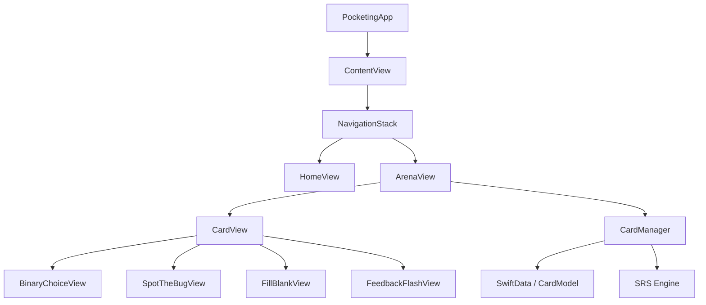

# Pocketing — Build Complete ✅

> Neobrutalist CS Micro-Learning iOS App • SwiftUI + SwiftData • 100% Offline

## Project Statistics
| Metric | Value |
|--------|-------|
| Total Swift Files | 14 |
| Total Swift LOC | 1,135 |
| Seed Cards | 21 (7 per course) |
| Challenge Types | 3 (binaryChoice, spotTheBug, fillBlank) |
| Courses | 3 (Concurrency, Data Structures, Operating Systems) |

## Architecture Overview

## File Map

### Models (3 files)
| File | Purpose |
|------|---------|
| [CardDTO.swift](file:///home/pieberrykinnie/pocketing/Pocketing/Models/CardDTO.swift) | Codable DTOs for JSON parsing |
| [CardModel.swift](file:///home/pieberrykinnie/pocketing/Pocketing/Models/CardModel.swift) | SwiftData `@Model` with SRS fields |
| [ChallengeData.swift](file:///home/pieberrykinnie/pocketing/Pocketing/Models/ChallengeData.swift) | Typed challenge structs + `DecodedChallenge` enum |

### ViewModels (1 file)
| File | Purpose |
|------|---------|
| [CardManager.swift](file:///home/pieberrykinnie/pocketing/Pocketing/ViewModels/CardManager.swift) | SRS engine + 3-tier priority queue |

### Views (8 files)
| File | Purpose |
|------|---------|
| [ContentView.swift](file:///home/pieberrykinnie/pocketing/Pocketing/Views/ContentView.swift) | NavigationStack root |
| [HomeView.swift](file:///home/pieberrykinnie/pocketing/Pocketing/Views/HomeView.swift) | Course selector grid |
| [ArenaView.swift](file:///home/pieberrykinnie/pocketing/Pocketing/Views/ArenaView.swift) | ZStack card deck + dismiss animation |
| [CardView.swift](file:///home/pieberrykinnie/pocketing/Pocketing/Views/Components/CardView.swift) | Progressive disclosure card |
| [NeoModifiers.swift](file:///home/pieberrykinnie/pocketing/Pocketing/Views/Components/NeoModifiers.swift) | Neobrutalist button styles + modifiers |
| [FeedbackFlashView.swift](file:///home/pieberrykinnie/pocketing/Pocketing/Views/Components/FeedbackFlashView.swift) | Green/red feedback banner |
| [BinaryChoiceView.swift](file:///home/pieberrykinnie/pocketing/Pocketing/Views/Challenges/BinaryChoiceView.swift) | Two-option challenge |
| [SpotTheBugView.swift](file:///home/pieberrykinnie/pocketing/Pocketing/Views/Challenges/SpotTheBugView.swift) | Tappable code line challenge |
| [FillBlankView.swift](file:///home/pieberrykinnie/pocketing/Pocketing/Views/Challenges/FillBlankView.swift) | Code gap + 3 pill options |

### Utilities (2 files)
| File | Purpose |
|------|---------|
| [DesignTokens.swift](file:///home/pieberrykinnie/pocketing/Pocketing/Utilities/DesignTokens.swift) | Colors, fonts, metrics, animations |
| [DataSeeder.swift](file:///home/pieberrykinnie/pocketing/Pocketing/Utilities/DataSeeder.swift) | First-launch JSON → SwiftData seeder |

### Resources & Config
| File | Purpose |
|------|---------|
| [content.json](file:///home/pieberrykinnie/pocketing/Pocketing/Resources/content.json) | 21 seed cards with real CS content |
| [Info.plist](file:///home/pieberrykinnie/pocketing/Pocketing/Info.plist) | Portrait-only, iOS 17+ |
| [Package.swift](file:///home/pieberrykinnie/pocketing/Package.swift) | Swift Package manifest |

## Key Design Decisions (from Q&A)

1. **Unseen vs Reset cards**: `timesAnswered` field distinguishes never-answered (unseen) from incorrectly-answered (reset) cards
2. **Queue batching**: Buffer of 10, refill at < 3, treadmill batches of 5
3. **Card deck depth**: Top 3 cards visible with scale/offset stacking
4. **Navigation**: `NavigationStack` with `String`-based `navigationDestination`
5. **SRS intervals**: 1 → 3 → 7 → 30 days (Leitner buckets)
6. **Empty state**: "ALL CAUGHT UP!" screen when no cards remain

## How to Build

> [!IMPORTANT]
> This project requires **Xcode 15+** and targets **iOS 17+**.

1. Open `Pocketing/` directory in Xcode as a Swift Package project, or create an Xcode project and add these files
2. Ensure `content.json` is included in the target's **Copy Bundle Resources** build phase
3. Build and run on a simulator or device running iOS 17+
